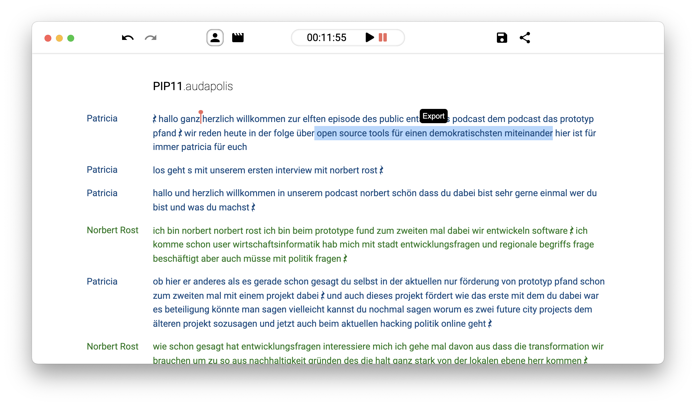

# 
🎤 audapolis

> **
An editor for spoken-word media with transcription.
**

`audapolis` aims to make the workflow for spoken-word-heavy media editing easier, faster and more accessible.
* It gives you a **wordprocessor-like experience** for media editing.
* It can **automatically transcribe** your audio to text.
* It can be used for **Video, Audio** and mixed editing - Do radio shows, podcasts, audiobooks, interview clips or anything you like.
* It is **free**
* It keeps the data in your hands - **no cloud** whatsoever.

## ✨ Try it now! ✨

You can download the newest version for Windows, Linux and macOS [here](https://github.com/audapolis/audapolis/releases/latest).
If you find any bugs or UX inconveniences, we would be happy for you to [report them to us](https://github.com/audapolis/audapolis/issues/new).

## Survey

It would be really nice if you could help us out by answering [our short survey](https://docs.google.com/forms/d/e/1FAIpQLSerdLMYw3C3sfCyliGTal_CfeH5_jw4l2Zv-NmYc8GEabpHnA/viewform) about your needs & expectations so that we can build actually usefull software and know what you need.

## Acknowledgements

* Funded from September 2021 until February 2022 by 
